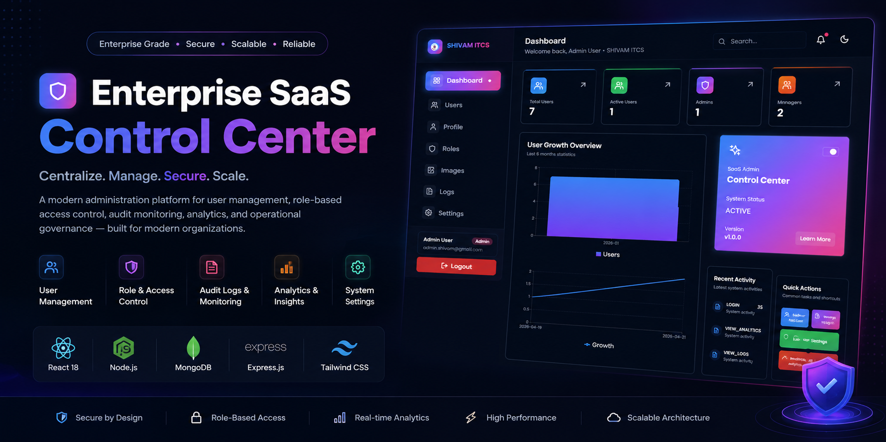
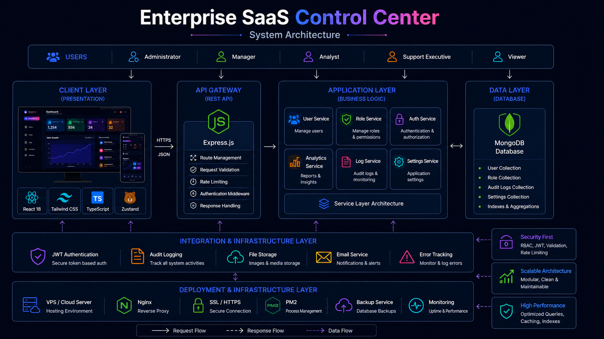
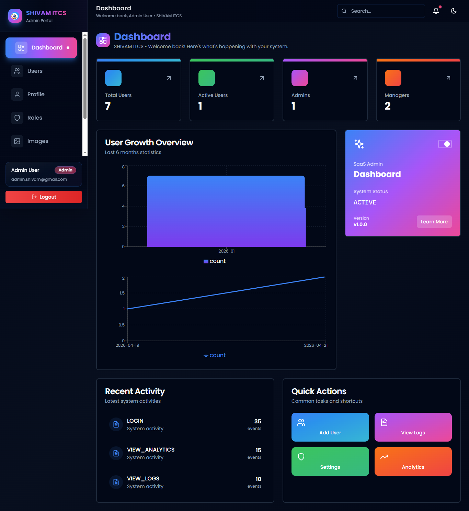
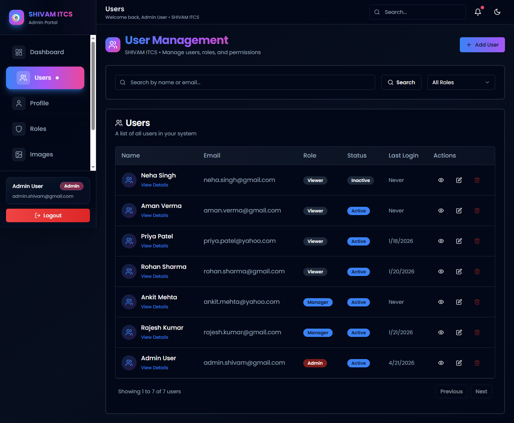
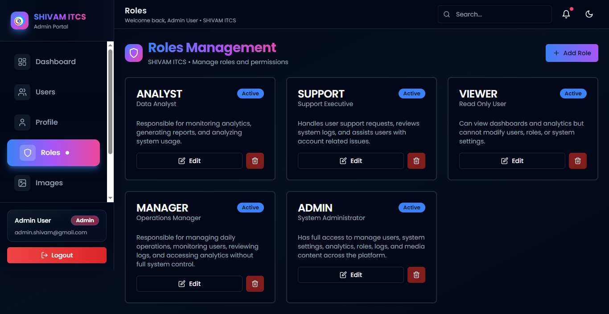
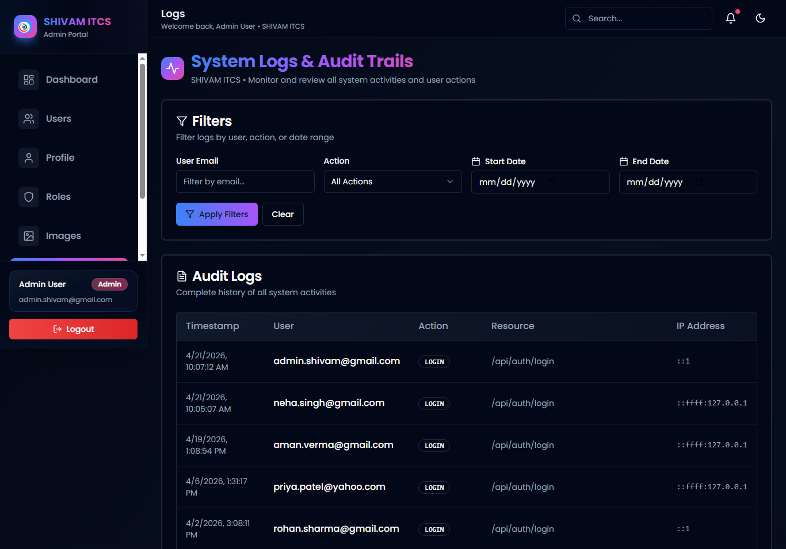
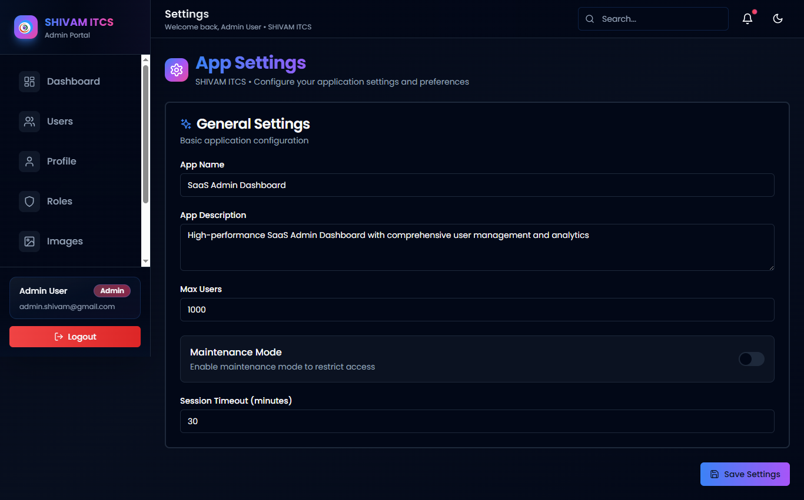
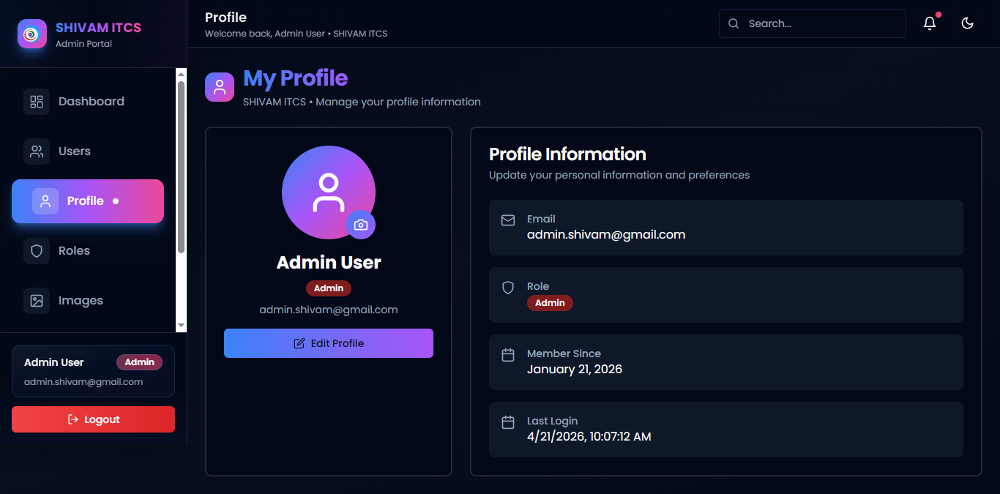

# Enterprise SaaS Control Center


Enterprise-grade SaaS administration platform engineered for identity management, access governance, operational analytics, audit monitoring, and centralized business operations through a modern full-stack architecture.

---

<p align="center">
  
</p>

---

## 🌐 Live Platform

🌐 https://mern.shivamitcs.in

---

# Platform Vision

Enterprise SaaS Control Center is designed to centralize administration, governance, security operations, and business management into one unified platform.

Modern organizations require secure user administration, role governance, operational visibility, audit compliance, and scalable management systems. This platform provides a centralized operational environment engineered for enterprise-grade workflows and modern SaaS infrastructure.

---

# Platform Highlights

* Identity & Access Management
* Role-Based Access Control (RBAC)
* User Lifecycle Management
* Audit Logging Infrastructure
* Operational Analytics
* Governance & Compliance Monitoring
* Application Configuration Management
* Media & Asset Management
* Secure Administrative Operations
* Enterprise Dashboard Experience

---

# 👥 Role-Based Governance System

The platform provides secure operational environments through configurable role-based access controls.

## Supported Roles

* Super Admin
* Administrator
* Manager
* Analyst
* Support Executive
* Viewer

---

# Enterprise Features

* Enterprise dashboard experience
* Secure authentication infrastructure
* Centralized user administration
* Operational governance controls
* Audit logging and monitoring
* Analytics and reporting
* Role management system
* Modern responsive interface
* Dark mode support
* Production-ready architecture

---

# Technology Stack

## Frontend Engineering

* React 18
* TypeScript
* Tailwind CSS
* shadcn/ui
* Framer Motion
* Zustand
* Recharts

---

## Backend Infrastructure

* Node.js
* Express.js
* JWT Authentication
* REST API Architecture
* Service Layer Architecture
* Middleware-Based Security

---

## Database Layer

* MongoDB
* Mongoose ODM
* Indexed Collections
* Aggregation Pipelines

---

## Security Infrastructure

* JWT Authentication
* Password Hashing
* RBAC Authorization
* Input Validation
* Rate Limiting
* Secure Middleware
* Audit Logging

---

## Architecture & Operations

* MERN Stack Architecture
* Service Layer Pattern
* Modular System Design
* Scalable API Infrastructure
* Enterprise Administration Architecture

---

# Architecture Highlights

* Role-based governance architecture
* Layered MERN application design
* Audit-centric operational workflows
* Secure authentication infrastructure
* Centralized administration platform
* Scalable service-layer architecture

---

# System Architecture

The platform follows a scalable enterprise architecture built for identity management, access governance, analytics, audit monitoring, and operational administration.

<p align="center">
  
</p>

---

# Platform Preview

Modern administration experiences engineered for business operations, governance workflows, security controls, and enterprise management.

---

# 🌐 Dashboard Screenshots

### 📊 Executive Dashboard

<p align="center">
  
</p>

---

### 👥 User Management

<p align="center">
  
</p>

---

### 🔐 Role Management

<p align="center">
  
</p>

---

### 📋 Audit Monitoring

<p align="center">
  
</p>

---

### ⚙️ Configuration Management

<p align="center">
  
</p>

---

### 👤 Profile Management

<p align="center">
  
</p>

---

# 🔐 Security Architecture

Enterprise SaaS environments require strong governance and security controls.

The platform includes:

* JWT authentication workflows
* Role-based access control
* Protected administrative routes
* Secure password management
* Operational audit trails
* Activity monitoring infrastructure
* Administrative security controls

---

# ⚡ Scalability Engineering

The platform is engineered to support growing operational workloads and organizational scaling.

## Scalability Features

* Modular architecture
* Service-layer pattern
* Database indexing
* Optimized API workflows
* Efficient query processing
* Pagination infrastructure
* Scalable administration systems

---

# Business Problem

Organizations often face challenges with:

* fragmented user administration
* inconsistent permission management
* limited operational visibility
* lack of audit accountability
* disconnected administrative workflows
* inefficient governance processes

These challenges increase operational complexity, security risks, and administrative overhead.

---

# Business Outcomes

* Improved governance visibility
* Centralized administrative operations
* Reduced access management complexity
* Enhanced audit readiness
* Better operational control
* Improved security oversight

---

# Key Use Cases

* Enterprise administration platforms
* Internal operations dashboards
* Identity and access management systems
* Governance and compliance portals
* Audit monitoring platforms
* Administrative control centers
* Multi-team management systems

---

# Solution

Enterprise SaaS Control Center centralizes administration, governance, analytics, and security operations into a unified management platform.

The platform enables:

* centralized user management
* secure access governance
* operational monitoring
* audit visibility
* administrative efficiency
* scalable business operations
* governance and compliance support

---

# Platform Focus Areas

* Enterprise SaaS
* Identity Management
* Access Governance
* Administrative Operations
* Security Infrastructure
* Audit Monitoring
* Business Operations
* Operational Analytics

---

# Product Roadmap

### Phase 1 — Administration Foundation

* User management
* Role management
* Authentication system
* Dashboard infrastructure
* Operational controls

---

### Phase 2 — Governance Layer

* Advanced permissions
* Audit monitoring
* Security analytics
* Governance workflows
* Compliance visibility

---

### Phase 3 — Operational Intelligence

* Enhanced analytics
* Advanced reporting
* Workflow automation
* Business insights
* Operational optimization

---

### Phase 4 — Enterprise Expansion

* Multi-tenant architecture
* Advanced governance
* Enterprise integrations
* Organizational scaling
* Future-ready operations

---

# Deployment Infrastructure

* VPS deployment
* Cloud-ready architecture
* Environment-based configuration
* Secure production workflows
* Scalable infrastructure support

---

# Repository Structure

```txt
assets/
├── architecture/
├── branding/
├── screenshots/
└── workflows/
```

# Engineering Vision

Enterprise SaaS Control Center represents a modern administration and governance platform engineered for scalable operations, secure access management, operational visibility, and business efficiency.

Designed with an enterprise engineering mindset, the platform focuses on governance, security, operational scalability, and centralized management experiences.

---

# Why This Platform Exists

Organizations require more than basic dashboards.

They need centralized governance systems capable of managing users, permissions, operational visibility, security monitoring, and administrative workflows from a single platform.

Enterprise SaaS Control Center was created to provide a scalable foundation for secure business operations and modern administrative experiences.

---

# 🤝 Contributing

Contributions are welcome.

Please ensure all contributions follow established architecture patterns, coding standards, and security practices.

---

# 📄 License

MIT License

Copyright © 2026 SHIVAM ITCS
